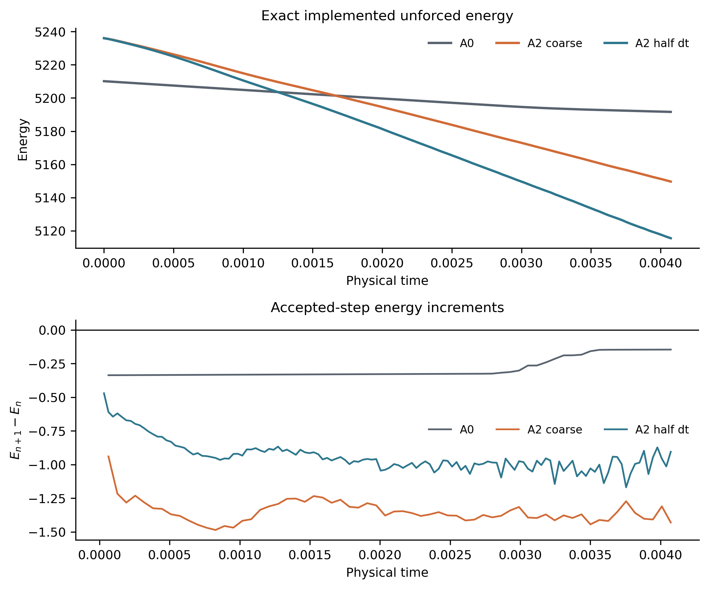
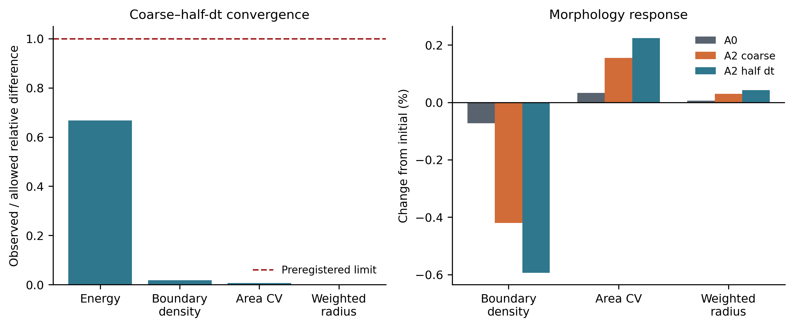
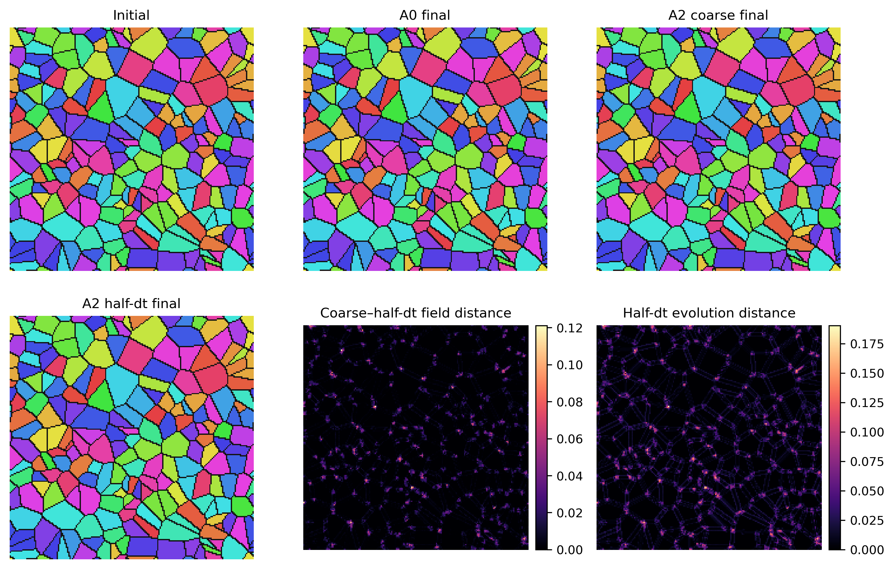
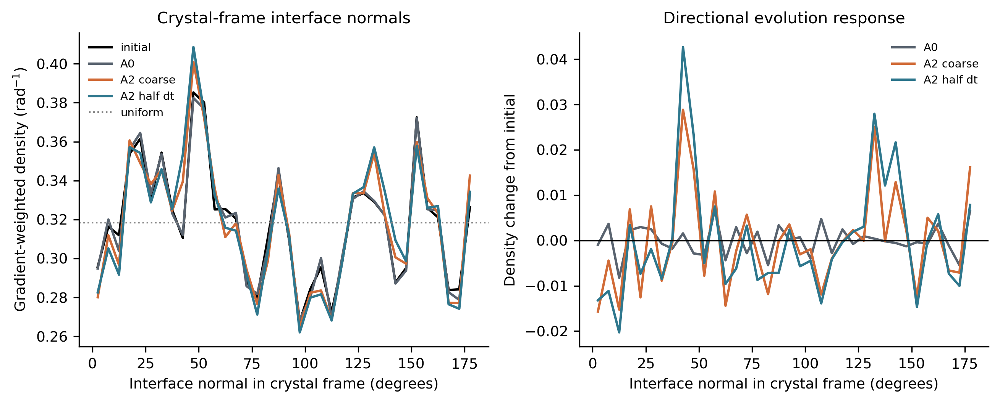
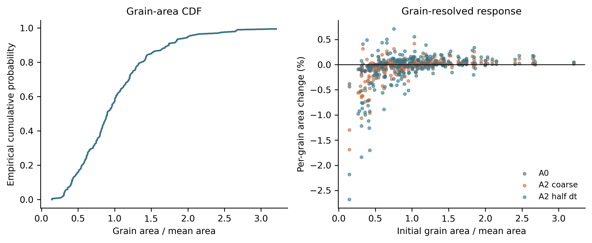
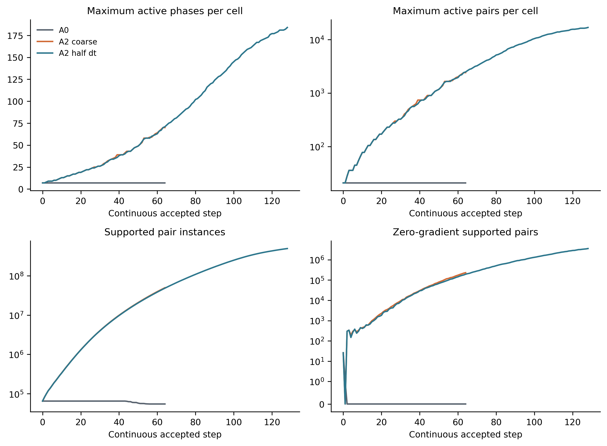
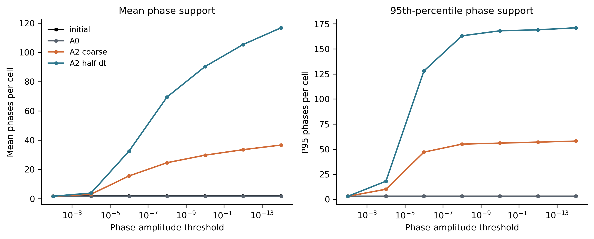
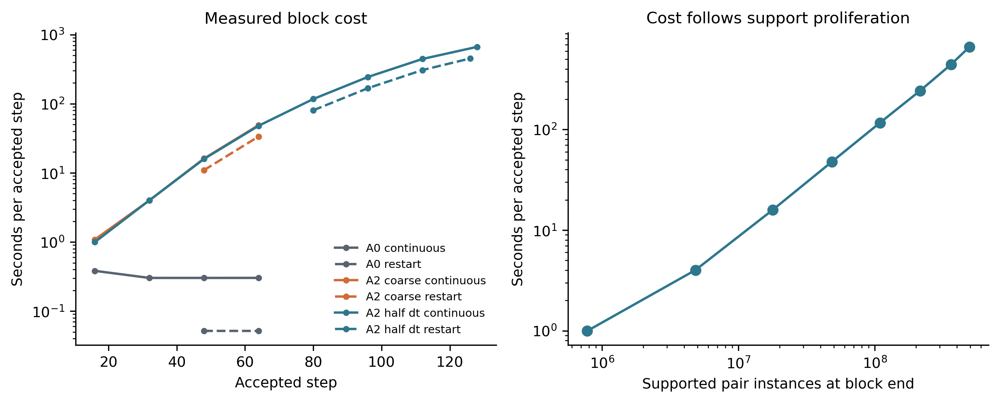

# Phase-1 anisotropic postfix post-simulation analysis

## Scope and evidence

This analysis uses the verified output of Slurm job 56017421, runner
`20260914T202421Z-nogit-f0fd7d`, scientific source
`1316cc89dbabfb41cb883b0d4a4c74738cc2bef6`, and result archive SHA-256
`b1d3eec6b0b693641958c78fcc73bf2bd7a83bc827eff861fdd661cfd116fc42`.
The deterministic initial field was independently reconstructed and matched
SHA-256
`2986f2bf744107c46aeedf05d00849a5f35db8c3ba85f70f7a7645b7922b2e61`;
the orientations matched
`217578bc628ee08179cf59123c21a9af7b31ecdfc4eb8ee6a0816446221f3141`.

All three continuous trajectories are complete. A0 and coarse A2 also have
complete, exact midpoint restarts. The half-dt A2 restart is exact through
accepted step 126 of 128 but lacks the final two steps. The continuous-field
analysis below is complete; claims about fine restart equivalence retain that
limitation.

The compact analysis directory is
`results/long_time_kinetics_900K_anisotropic_20260910/20260915T082458Z-postfix-recovery-analysis`.
It contains the plotted data as CSV, a machine-readable summary, provenance,
PDF and 300-dpi PNG figures, and a checksum manifest. The analysis can be
regenerated with:

```sh
PYTHONPATH=src:. python scripts/analyze_anisotropic_postfix.py \
  /Users/sdillon/HPC3/anisotropic-phase1-state/extracted-20260915T0825Z/output/postfix \
  results/long_time_kinetics_900K_anisotropic_20260910/20260915T082458Z-postfix-recovery-analysis
```

## Energy and timestep behavior

| Case | States | Initial energy | Final energy | Relative change | Maximum increment | Positive steps |
|---|---:|---:|---:|---:|---:|---:|
| A0 | 65 | 5210.112257 | 5191.606175 | -0.3552% | -0.145807 | 0 |
| A2 coarse | 65 | 5236.012485 | 5149.634685 | -1.6497% | -0.939901 | 0 |
| A2 half dt | 129 | 5236.012485 | 5115.519300 | -2.3012% | -0.470392 | 0 |

Every accepted step decreases its exact implemented unforced energy. A0 and A2
have different energy functionals, so their absolute energy offsets are not a
common thermodynamic scale. Within-case fractional decay shows that A2 changes
the qualification trajectory materially over this short horizon.



At the matched physical horizon, the coarse/half-dt final-energy difference is
0.6669%, below the preregistered 1% limit. Relative morphology differences are
0.1750% for boundary density, 0.0692% for grain-area CV, and 0.0134% for
area-weighted radius, all well below the 10% limits. This is a pass of the
declared two-level convergence gate. Two timestep levels cannot establish a
formal convergence order or a continuum-extrapolated value.



## Field and morphology response

All cases retain 200 active grains. Boundary density changes by -0.0725% for
A0, -0.4203% for coarse A2, and -0.5942% for half-dt A2. Grain-area CV changes
by +0.0326%, +0.1546%, and +0.2240%, respectively. Area-weighted mean radius
changes by +0.0061%, +0.0294%, and +0.0429%.

The half-dt A2 field differs from its initial field by phase-field RMS 0.01868,
with dominant-label changes on 0.1899% of cells. Coarse and half-dt A2 differ
by RMS 0.00847 and disagree in dominant label on 0.0895% of cells. Evolution is
therefore localized primarily to interfaces and junctions, as the field-distance
maps show.



The gradient-weighted interface-normal distribution was also transformed into
each grain's crystal frame, which pools randomly oriented grains without
erasing crystal-relative directionality. A0 leaves the fourth harmonic nearly
unchanged, from 0.02741 initially to 0.02739. A2 raises it to 0.03747 at the
coarse timestep and 0.04389 at half dt. The eighth harmonic likewise rises from
0.00577 initially to 0.01269 and 0.01701. This is direct evidence that the A2
trajectory produces a crystal-relative directional interface response. The
single initial network and short horizon do not support a population-level
texture-selection claim.



The grain-size CDFs remain nearly coincident because this is a qualification
horizon rather than a coarsening campaign. Per-grain changes expose the small
response hidden by the population distribution: RMS area change is 0.0574% for
A0, 0.2674% for coarse A2, and 0.4427% for half-dt A2. The largest absolute
per-grain changes are 0.435%, 1.687%, and 2.679%, respectively.



## Support proliferation and computational cost

The dominant post-simulation finding is support proliferation in the A2
operator. At the production support threshold of 1e-14, the half-dt final state
has a mean 116.8 phases per cell and a 95th percentile of 171, compared with
1.84 and 3 in the initial state. The stencil-expanded diagnostic maximum
reaches 184 phases and 16,836 pairs per cell, with 494,818,360 supported pair
instances. Coarse A2 already reaches 70 phases, 2,415 pairs per cell, and
49,763,328 instances.



This large combinatorial support is dominated by low-amplitude tails rather
than equivalent physical mixing among hundreds of phases. At amplitude 0.01,
the half-dt state has mean support 1.62 and 95th-percentile support 3; its mean
inverse-participation phase count is only 1.278. At 1e-4 the mean rises to 3.82
and the 95th percentile to 18, while at 1e-14 they rise to 116.8 and 171. The
current 1e-14 support rule therefore converts widespread numerical tails into
an enormous pair-interaction workload.



Measured cost follows this support growth. Fine continuous cost rises from
0.995 seconds per accepted step in steps 1–16 to 664.1 seconds per step in
steps 113–128. The partial fine restart shows the same pattern, reaching 451.4
seconds per step for steps 113–126. A0 stays near 0.30 seconds per continuous
step after its first block. This is a roughly 2,200-fold late-stage A2/A0 cost
difference, and the log-log block plot tracks supported-pair count closely.



## Restart and validity assessment

A0 continuous and restart fields have the identical SHA-256
`1d53555e5a2a345ca5bf04e22f1daf6ffbad6a67d663e2fe369819189e868850`.
Coarse A2 continuous and restart fields have the identical SHA-256
`705c5a32329aa697b51273a473c6a3143e1c12c35ff126bf6f915a4ed89a36f3`.
The half-dt continuous final field hash is
`a12a42877337e1c2f71d52c1a6415ee424ace386f7abf3325e9070208d25bc62`;
the step-126 restart field hash is
`52a8b65b8b7cdbd662d2dce7279a78664e812b2c0b7b33b4aa5ad4331ca66101`.
They must not be compared as equal-time states because the replay is two steps
short.

Every recorded state is finite and nonnegative. Maximum phase-sum error is
4.44e-16 for A0 and 2.22e-16 for A2. The smallest recorded nonzero pair-gradient
magnitude is 7.89e-31, and the zero-gradient branch stays finite. These results
remove the earlier singularity as the cause of failure.

## Interpretation

Under the assumption that the completed continuous trajectories represent the
requested simulations, the corrected homogeneous-norm A2 energy operator has
three favorable properties: strict observed energy descent, a passing declared
coarse/half-dt comparison, and finite behavior through extremely small and zero
pair gradients. It also produces a measurable interfacial response relative to
A0 over the short qualification horizon.

The model is not operationally ready for reduced controls or production. Its
support definition admits low-amplitude phase tails that proliferate across the
domain, causing pair count and runtime to grow by orders of magnitude while the
effective physical phase count stays near one to two. This is the primary
engineering and numerical issue exposed by the post-analysis. Any support
truncation or active-set repair would change the discrete operator and must be
derived, conservation-checked, and requalified rather than applied as an
after-the-fact performance tweak.

The formal classification remains `A2_POSTFIX_OPERATIONALLY_INCOMPLETE`
because exact half-dt restart equivalence is missing two steps. Mobility-only,
combined A2, A3, and production remain unreleased. The archive contains one
deterministic initial condition and a short physical horizon, so it supports no
ensemble uncertainty, long-time growth law, texture-selection, or production
kinetics claim.
